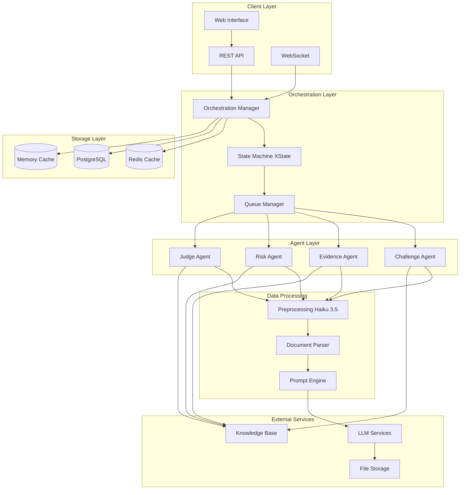
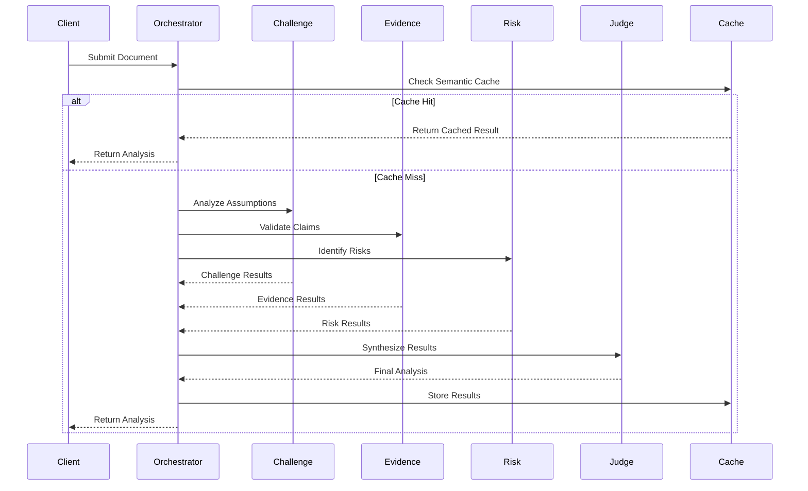
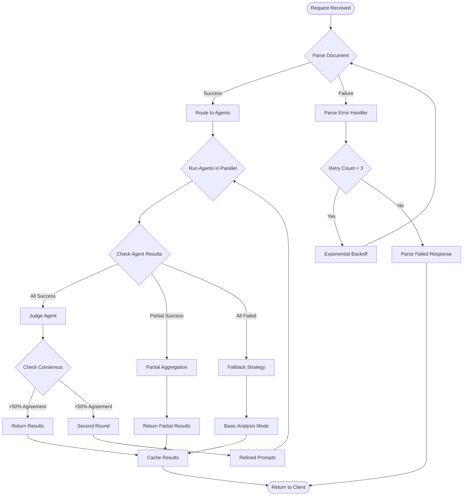
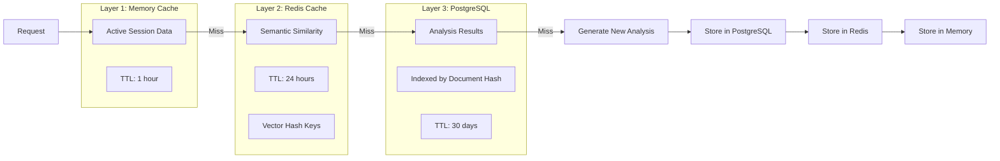
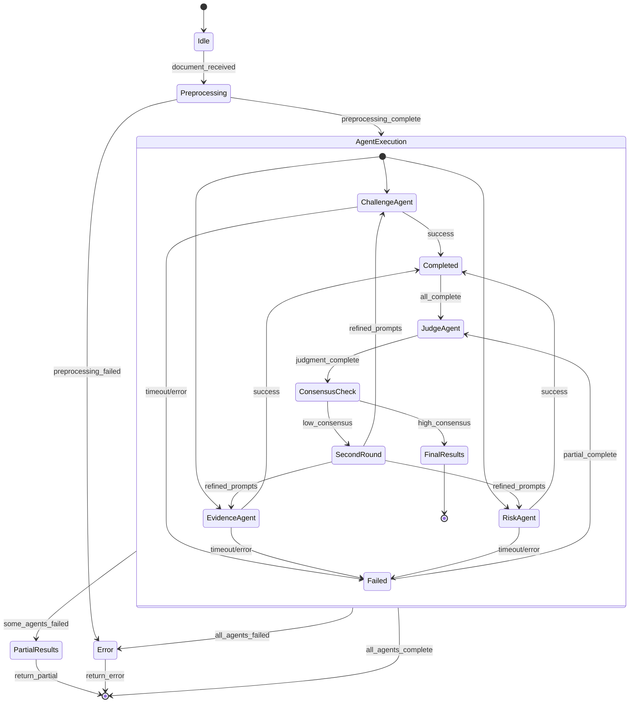

# PrismForge AI System Architecture

## System Overview

PrismForge AI is a multi-agent validation platform for M&A due diligence that employs four specialized agents working in concert to validate deal assumptions, identify risks, and provide comprehensive analysis.

## Component Interaction Architecture

## Data Flow Architecture

## Error Handling Decision Tree

## Caching Strategy (3-Layer)

## State Management with XState

## Performance Requirements

- **Agent Timeout**: 30-second hard limit per agent
- **Total Analysis Time**: <2 minutes for standard documents
- **Concurrent Sessions**: Support 100+ simultaneous analyses
- **Cache Hit Rate**: >80% for semantic similarity
- **Availability**: 99.9% uptime

## Security Considerations

- Document encryption at rest and in transit
- Agent isolation with sandboxed execution
- Rate limiting per client/API key
- Audit logging for all analyses
- PII detection and redaction

## Scalability Design

- Horizontal scaling of agent workers
- Redis Cluster for distributed caching
- PostgreSQL read replicas
- Load balancing with session affinity
- Auto-scaling based on queue depth